# 🚀 Projet Kubernetes --- PayMyBuddy (sans Helm)

Déploiement de l'application **PayMyBuddy (Spring Boot)** sur Kubernetes
avec des manifests YAML écrits à la main.

------------------------------------------------------------------------

## 🧭 Environnement

-   💻 **Hôte** : Windows\
-   🖥 **VM** : Ubuntu 22.04 (Vagrant + VirtualBox)\
-   ☸️ **Cluster** : Minikube (driver Docker)

------------------------------------------------------------------------

## 📑 Sommaire

-   Architecture
-   Prérequis
-   Structure du projet
-   Déploiement
-   Accès
-   Scripts
-   Persistance
-   Dépannage
-   Limitations

------------------------------------------------------------------------

## 🏗 Architecture

``` text
[ Navigateur ]
      │
      ▼
192.168.56.100:30080
      │
      ▼
┌────────────────────────────┐
│ VM Ubuntu (Vagrant)        │
│                            │
│  ┌──────────────────────┐  │
│  │ Minikube             │  │
│  │                      │  │
│  │  ┌───────────────┐   │  │
│  │  │ PayMyBuddy    │───┼────► MySQL
│  │  │ (Spring Boot) │   │  │
│  │  └───────────────┘   │  │
│  │        │             │  │
│  │  NodePort:30080      │  │
│  │                      │  │
│  │        ▼             │  │
│  │   Service MySQL      │  │
│  │   ClusterIP:3306     │  │
│  │        │             │  │
│  │        ▼             │  │
│  │     PVC (2Gi)        │  │
│  └──────────────────────┘  │
└────────────────────────────┘
```

------------------------------------------------------------------------

## 🔄 Flux de connexion

    Windows → NodePort → Pod PayMyBuddy → MySQL

------------------------------------------------------------------------

## 🔐 Sécurité (Secrets)

-   Aucun mot de passe en clair
-   Injection via `secretKeyRef`
-   Partagé entre MySQL et l'application
-   Utilisateur dédié `paymybuddy_user` (sans droits root)
-   L'utilisateur root MySQL n'est pas exposé à l'application

L'application Spring Boot se connectait à MySQL avec l'utilisateur root, 
qui dispose de tous les droits sur l'ensemble du serveur de base de données. 
C'est une mauvaise pratique car en cas de compromission de l'application, un attaquant aurait un accès total à MySQL.

J'ai appliqué le principe du moindre privilège en créant un utilisateur dédié paymybuddy_user qui n'a des droits que sur la base db_paymybuddy. Concrètement :

Dans le Secret Kubernetes, j'ai remplacé root par paymybuddy_user avec son propre mot de passe
L'image MySQL officielle crée automatiquement cet utilisateur au premier démarrage via les variables MYSQL_USER et MYSQL_PASSWORD
L'application récupère ces credentials via secretKeyRef, sans aucune valeur en dur dans les manifests
Le compte root reste uniquement utilisé en interne par MySQL pour la probe de santé (mysqladmin ping)

Résultat

# L'application n'a plus accès qu'à sa propre base de données, et aucun credential n'est exposé en clair dans les fichiers YAML.
------------------------------------------------------------------------

## ❤️ Health Checks

  Service      Type                 Endpoint
  ------------ -------------------- -------------------
  PayMyBuddy   readiness/liveness   `/login`
  MySQL        readiness            `mysqladmin ping`

------------------------------------------------------------------------

## 📦 Structure du projet

``` bash
PAYMYBUDDY_K8S/
├── deploy.sh
├── cleanup.sh
├── bootstrap.sh
├── setup-network.sh
├── mysql-*.yaml
├── paymybuddy-*.yaml
```

------------------------------------------------------------------------

## ⚙️ Déploiement rapide

``` bash
## ⚙️ Déploiement rapide (utilise l'image DockerHub existante)
# 1. Réseau + Déploiement uniquement
cd ~/PAYMYBUDDY_K8S
bash deploy.sh
bash setup-network.sh

---

## 🔧 Build & Publication (pour les contributeurs)
# 1. Installer Java
bash bootstrap.sh
# 2. Build app
cd ~/PayMyBuddy
./mvnw clean install -DskipTests
# 3. Build & push de l'image Docker
docker build -t USER/paymybuddy .
docker push USER/paymybuddy

```

------------------------------------------------------------------------

## 🌐 Accès

👉 http://192.168.56.100:30080

------------------------------------------------------------------------

## 🧪 Comptes de test

  Email               Nom      Solde
  ------------------- -------- -------
  hayley@mymail.com   Hayley   10€
  clara@mail.com      Clara    133€

------------------------------------------------------------------------

## 📜 Scripts

  Script             Description
  ------------------ ---------------
  bootstrap.sh       Installe Java
  deploy.sh          Déploie tout
  setup-network.sh   Accès réseau
  cleanup.sh         Reset complet

------------------------------------------------------------------------

## 💾 Persistance

-   MySQL → PVC (2Gi)
-   Données persistantes entre déploiements

------------------------------------------------------------------------

## 🛠 Dépannage rapide

``` bash
kubectl get pods -n paymybuddy
kubectl logs -n paymybuddy -l app=paymybuddy
kubectl describe pod -n paymybuddy
```

------------------------------------------------------------------------

## ⚠️ Limitations DEV

  Limite            Solution
  ----------------- ------------------------
  Pas de TLS        Ingress + cert-manager
  1 replica         HA (3 replicas)
  Secrets simples   Vault

------------------------------------------------------------------------

## 🖼 Illustrations

<p align="center">
  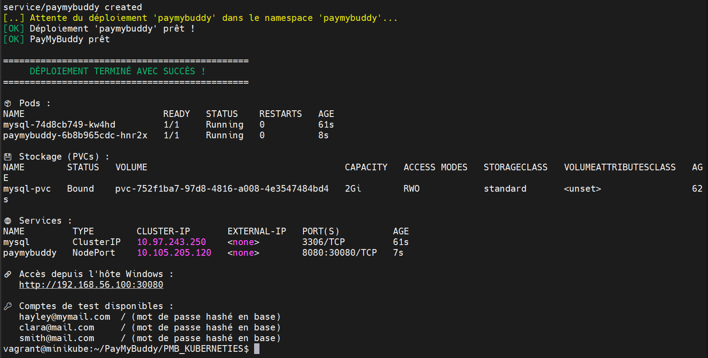<br><br>
  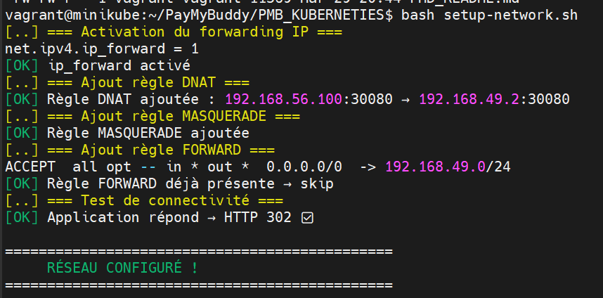<br><br>
  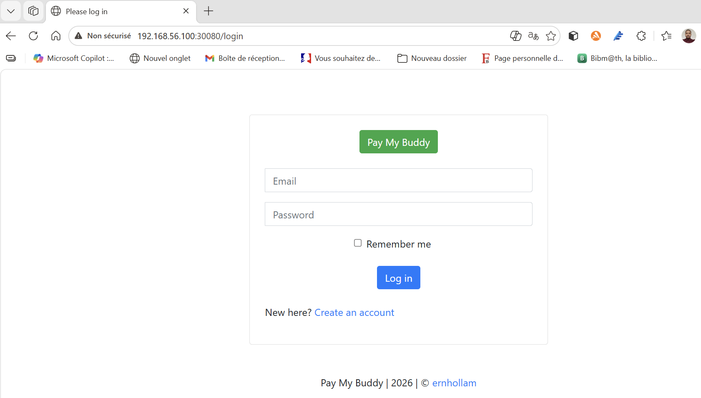<br><br>
  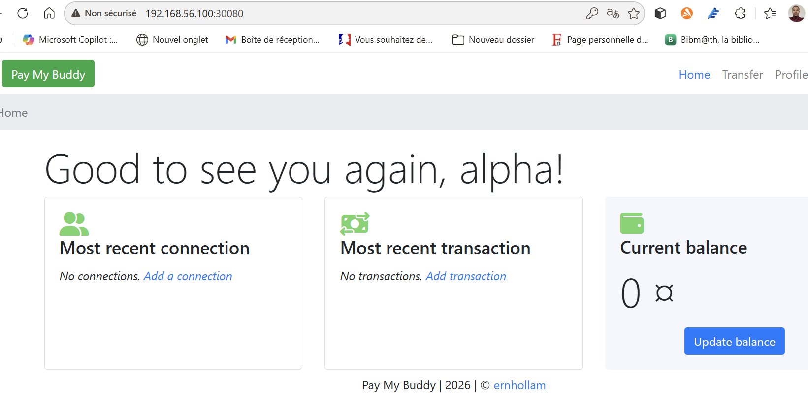<br><br>
  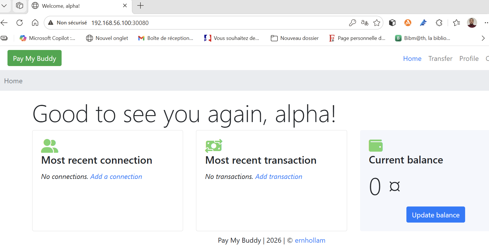<br><br>
  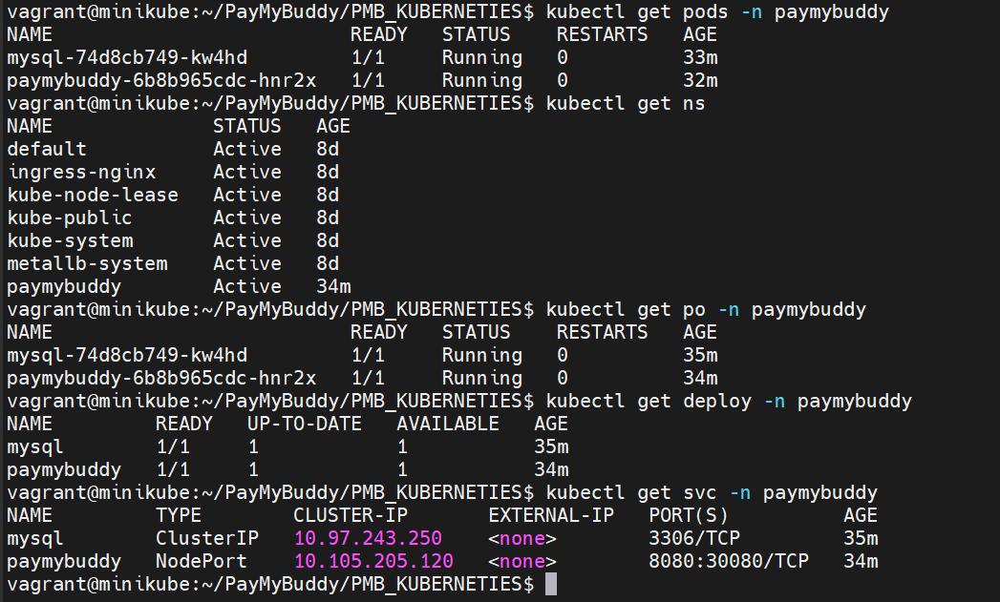<br><br>
  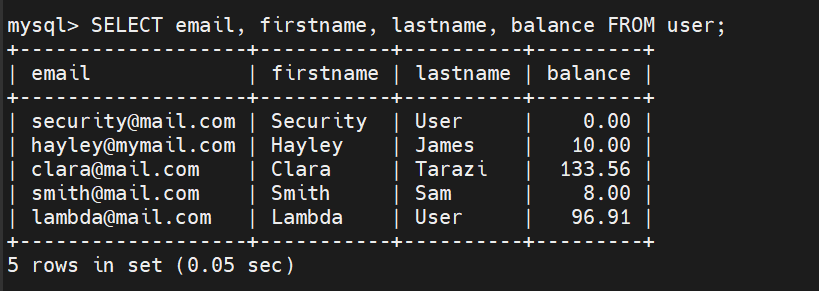<br><br>
  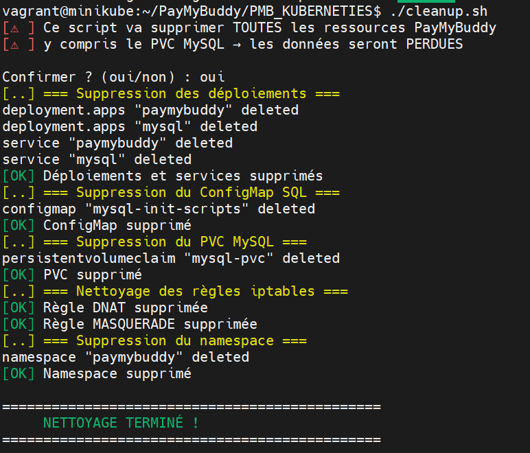<br><br>
  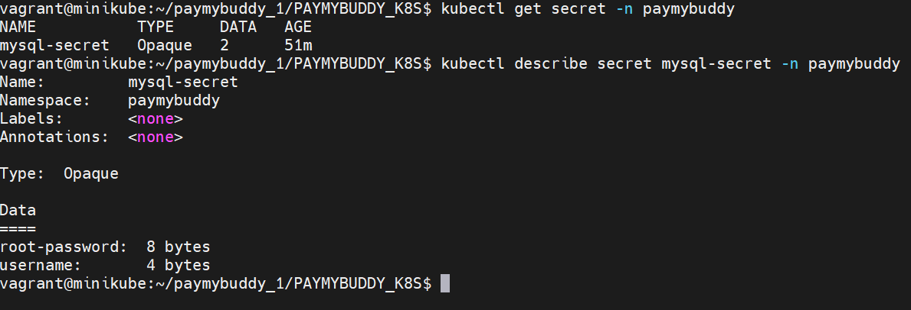<br><br>
  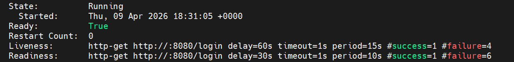<br><br>
  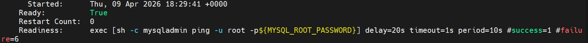<br><br>
  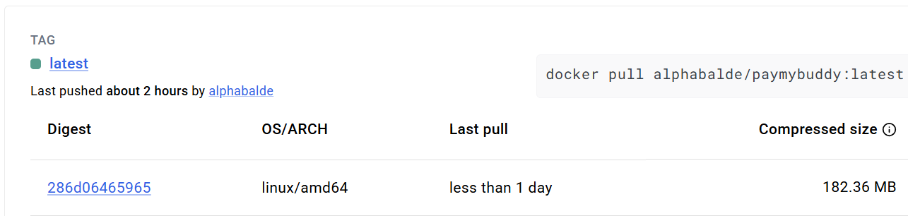<br><br>
</p>
------------------------------------------------------------------------

## ✅ Résumé

✔ Déploiement Kubernetes complet\
✔ Sécurité via Secrets\
✔ Persistance MySQL\
✔ Accès externe fonctionnel

------------------------------------------------------------------------

🔥 Projet prêt pour évoluer vers une architecture production !

