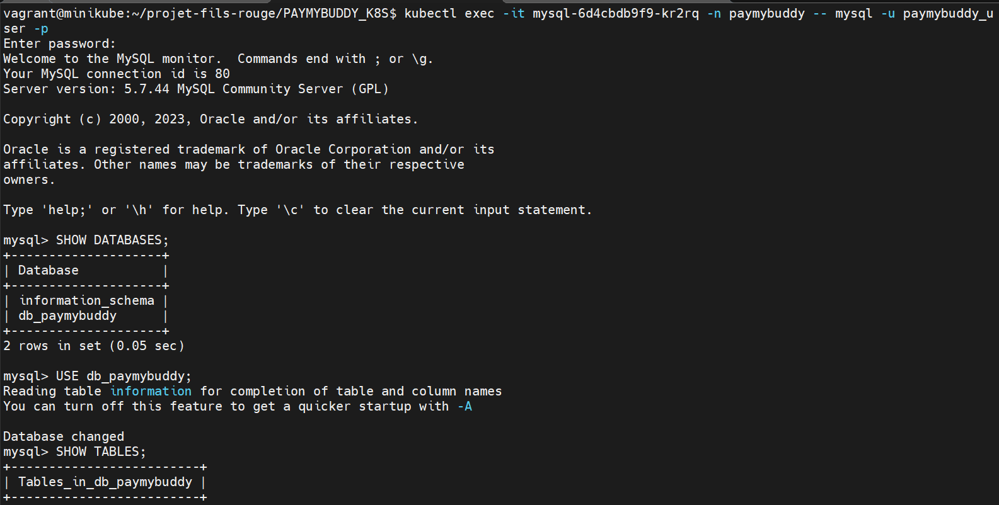
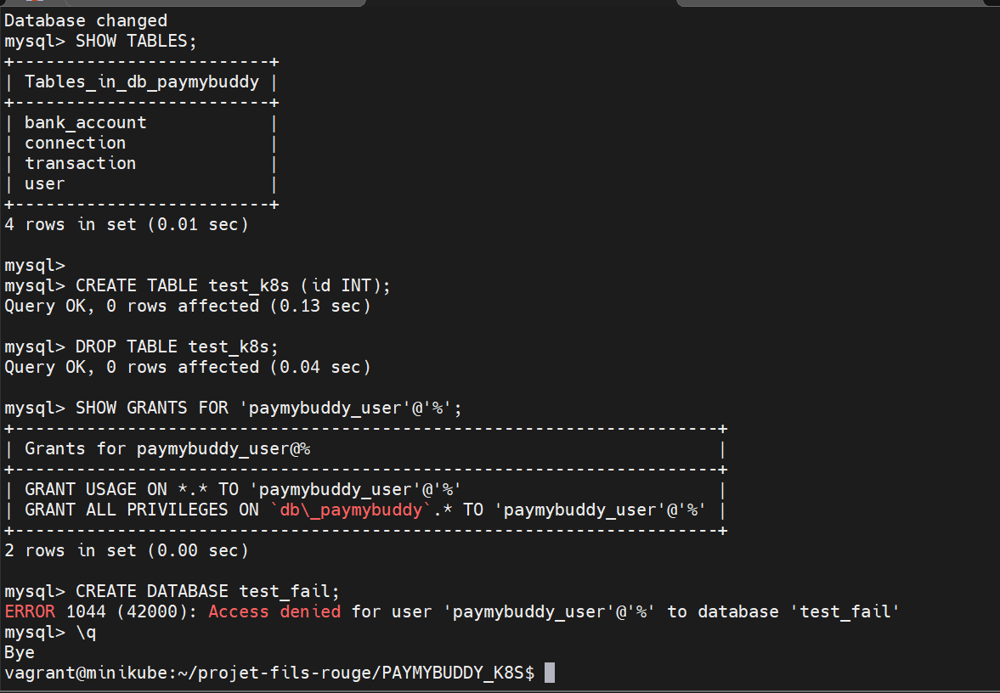

# 🚀 Projet Kubernetes --- PayMyBuddy (sans Helm)

Déploiement de l'application **PayMyBuddy (Spring Boot)** sur Kubernetes
avec des manifests YAML écrits à la main.

------------------------------------------------------------------------

## 🧭 Environnement

-   💻 **Hôte** : Windows
-   🖥 **VM** : Ubuntu 22.04 (Vagrant + VirtualBox)
-   ☸️ **Cluster** : Minikube (driver Docker)

------------------------------------------------------------------------

## 📑 Sommaire

-   Architecture
-   Prérequis
-   Structure du projet
-   Déploiement
-   Accès
-   Scripts
-   Persistance
-   Sécurité & Privilèges MySQL
-   DNS Minikube
-   Vérification de la base de données
-   Dépannage
-   Limitations

------------------------------------------------------------------------

## 🏗 Architecture

``` text
[ Navigateur ]
      │
      ▼
192.168.56.100:30080
      │
      ▼
┌────────────────────────────┐
│ VM Ubuntu (Vagrant)        │
│                            │
│  ┌──────────────────────┐  │
│  │ Minikube             │  │
│  │                      │  │
│  │  ┌───────────────┐   │  │
│  │  │ PayMyBuddy    │───┼────► MySQL
│  │  │ (Spring Boot) │   │  │
│  │  └───────────────┘   │  │
│  │        │             │  │
│  │  NodePort:30080      │  │
│  │                      │  │
│  │        ▼             │  │
│  │   Service MySQL      │  │
│  │   ClusterIP:3306     │  │
│  │        │             │  │
│  │        ▼             │  │
│  │     PVC (2Gi)        │  │
│  └──────────────────────┘  │
└────────────────────────────┘
```

------------------------------------------------------------------------

## 🔄 Flux de connexion

    Windows → NodePort → Pod PayMyBuddy → MySQL

------------------------------------------------------------------------

## 🔐 Sécurité & Privilèges MySQL

### Principe du moindre privilège

L'application Spring Boot se connectait initialement à MySQL avec
l'utilisateur `root`, qui dispose de tous les droits sur l'ensemble
du serveur de base de données. C'est une mauvaise pratique : en cas
de compromission de l'application, un attaquant aurait un accès total
à MySQL.

Le principe du moindre privilège a été appliqué en créant un
utilisateur dédié `paymybuddy_user` qui n'a des droits que sur
la base `db_paymybuddy`. Concrètement :

- Dans le Secret Kubernetes, `root` a été remplacé par `paymybuddy_user`
  avec son propre mot de passe
- L'image MySQL officielle crée automatiquement cet utilisateur au
  premier démarrage via les variables `MYSQL_USER` et `MYSQL_PASSWORD`
- L'application récupère ces credentials via `secretKeyRef`, sans
  aucune valeur en dur dans les manifests
- Le compte `root` reste uniquement utilisé en interne par MySQL pour
  la probe de santé (`mysqladmin ping`)

**Résultat** : l'application n'a plus accès qu'à sa propre base de
données, et aucun credential n'est exposé en clair dans les fichiers YAML.

### Problème classique : privilèges perdus après DROP/CREATE DATABASE

L'image Docker MySQL officielle crée l'utilisateur `paymybuddy_user`
**avant** l'exécution des scripts SQL du ConfigMap. Si le script
`create.sql` contient un `DROP DATABASE` suivi d'un `CREATE DATABASE`,
les privilèges accordés automatiquement par Docker au démarrage sont
perdus ou mal alignés.

De plus, par défaut, l'utilisateur créé via `MYSQL_USER` n'a des
privilèges que sur `MYSQL_DATABASE` — il ne peut pas `DROP` la base.

**Solution** : ajouter explicitement le `GRANT` à la fin de `create.sql` :

```sql
-- À la fin de create.sql — garantit les droits après recréation de la base
GRANT ALL PRIVILEGES ON db_paymybuddy.* TO 'paymybuddy_user'@'%';
FLUSH PRIVILEGES;
```

### Vérification des droits depuis le pod MySQL

```bash
# Connexion interactive à MySQL depuis le pod (remplacer le nom du pod)
kubectl exec -it <mysql-pod-name> -n paymybuddy -- mysql -u paymybuddy_user -p

# Dans le shell MySQL :
SHOW DATABASES;
-- Attendu : information_schema + db_paymybuddy

USE db_paymybuddy;
SHOW TABLES;
-- Attendu : bank_account, connection, transaction, user

SHOW GRANTS FOR 'paymybuddy_user'@'%';
-- Attendu :
-- GRANT USAGE ON *.* TO 'paymybuddy_user'@'%'
-- GRANT ALL PRIVILEGES ON `db_paymybuddy`.* TO 'paymybuddy_user'@'%'

-- Test rapide d'écriture/suppression
CREATE TABLE test_k8s (id INT);
DROP TABLE test_k8s;
```

------------------------------------------------------------------------

## 🔑 Inspection des Secrets Kubernetes

Les Secrets stockent les credentials MySQL encodés en base64.
Ils sont injectés dans les pods via `secretKeyRef` — jamais en clair
dans les manifests YAML.

```bash
# Lister les secrets du namespace
kubectl get secrets -n paymybuddy
# Attendu : mysql-secret   Opaque   4   <age>

# Inspecter le contenu encodé du secret
kubectl get secret mysql-secret -n paymybuddy -o yaml
# Les valeurs sont en base64 — pour décoder :
kubectl get secret mysql-secret -n paymybuddy -o jsonpath='{.data.mysql-database}' | base64 -d && echo
kubectl get secret mysql-secret -n paymybuddy -o jsonpath='{.data.mysql-user}'     | base64 -d && echo
kubectl get secret mysql-secret -n paymybuddy -o jsonpath='{.data.mysql-password}' | base64 -d && echo
```

------------------------------------------------------------------------

## ❤️ Health Checks

| Service      | Type                | Endpoint          |
|--------------|---------------------|-------------------|
| PayMyBuddy   | readiness/liveness  | `/login`          |
| MySQL        | readiness           | `mysqladmin ping` |

- **readinessProbe** : vérifie que l'application est prête à recevoir
  du trafic. Kubernetes n'envoie pas de requêtes au pod tant que cette
  probe n'est pas verte.
- **livenessProbe** : vérifie que l'application est toujours vivante.
  Kubernetes redémarre le pod si cette probe échoue.

<p align="center">
  <br><br>
  <br><br>
</p>

------------------------------------------------------------------------

## 🌐 DNS Minikube — Fix obligatoire

### Problème

Minikube en driver Docker utilise le DNS de Docker pour résoudre les
noms de domaine externes (Docker Hub, registry-1.docker.io...).
Sans configuration explicite, Docker hérite des DNS de la VM qui peuvent
être instables ou inaccessibles depuis le réseau interne Minikube.

**Symptôme** : les pods restent bloqués en `ImagePullBackOff` avec
l'erreur suivante :

```
Failed to pull image: Get "https://registry-1.docker.io/v2/":
context deadline exceeded (Client.Timeout exceeded while awaiting headers)
```

Pourtant, `docker pull` depuis la VM fonctionne — le problème est
spécifique au daemon Docker utilisé par Minikube.

### Solution — configurer les DNS Google dans Docker

```bash
# 1. Configurer les DNS Google pour le daemon Docker
sudo bash -c 'cat > /etc/docker/daemon.json << EOF
{
  "dns": ["8.8.8.8", "8.8.4.4"]
}
EOF'

# 2. Redémarrer Docker pour appliquer la configuration
sudo systemctl restart docker

# 3. Recréer Minikube (nécessaire pour hériter des nouveaux DNS)
minikube delete
minikube start --driver=docker

# 4. Vérifier que Docker Hub est accessible depuis Minikube
minikube ssh "curl -s -o /dev/null -w '%{http_code}' https://registry-1.docker.io/v2/"
# Attendu : 401 (accessible — 401 = auth requise, pas une erreur réseau)
```

> ⚠️ Cette configuration est **obligatoire avant le premier déploiement**
> sur une nouvelle VM. Sans elle, les pods ne peuvent pas puller les
> images depuis Docker Hub et restent en `ImagePullBackOff`.

------------------------------------------------------------------------

## 📦 Structure du projet

```bash
PAYMYBUDDY_K8S/
├── deploy.sh
├── cleanup.sh
├── bootstrap.sh
├── setup-network.sh
├── mysql-*.yaml
├── paymybuddy-*.yaml
```

------------------------------------------------------------------------

## ⚙️ Déploiement rapide

```bash
# 1. Fix DNS Docker (obligatoire sur nouvelle VM — à faire une seule fois)
sudo bash -c 'cat > /etc/docker/daemon.json << EOF
{
  "dns": ["8.8.8.8", "8.8.4.4"]
}
EOF'
sudo systemctl restart docker
minikube delete
minikube start --driver=docker

# 2. Déploiement + réseau
cd ~/PAYMYBUDDY_K8S
bash deploy.sh
bash setup-network.sh
```

---

## 🔧 Build & Publication (pour les contributeurs)

```bash
# 1. Installer Java
bash bootstrap.sh

# 2. Build de l'application
cd ~/PayMyBuddy
./mvnw clean install -DskipTests

# 3. Build & push de l'image Docker
docker login
docker build -t USER/paymybuddy .
docker push USER/paymybuddy
```

------------------------------------------------------------------------

## 🌐 Accès

👉 http://192.168.56.100:30080

------------------------------------------------------------------------

## 🧪 Comptes de test

| Email              | Nom    | Solde |
|--------------------|--------|-------|
| hayley@mymail.com  | Hayley | 10€   |
| clara@mail.com     | Clara  | 133€  |

------------------------------------------------------------------------

## 📜 Scripts

| Script            | Commande                        | Description                              |
|-------------------|---------------------------------|------------------------------------------|
| `deploy.sh`       | `bash deploy.sh`                | Déploiement complet                      |
| `deploy.sh`       | `bash deploy.sh clean`          | Supprime les ressources (PVC conservé)   |
| `deploy.sh`       | `bash deploy.sh clean --purge`  | Supprime tout y compris PVC et namespace |
| `setup-network.sh`| `bash setup-network.sh`         | Configure les règles iptables            |
| `setup-network.sh`| `bash setup-network.sh clean`   | Supprime les règles iptables du projet   |
| `bootstrap.sh`    | `bash bootstrap.sh`             | Installe Java                            |

> ⚠️ Les règles iptables sont perdues au reboot de la VM.
> Relancer `bash setup-network.sh` à chaque nouvelle session Minikube.

------------------------------------------------------------------------

## 💾 Persistance

- MySQL → PVC (2Gi)
- Données persistantes entre déploiements
- `bash deploy.sh clean` conserve le PVC → les données survivent
- `bash deploy.sh clean --purge` supprime le PVC → données perdues

------------------------------------------------------------------------

## 🛠 Dépannage rapide

```bash
# État général des pods
kubectl get pods -n paymybuddy

# Logs de l'application PayMyBuddy
kubectl logs -n paymybuddy -l app=paymybuddy

# Logs MySQL
kubectl logs -n paymybuddy -l app=mysql

# Détail d'un pod (events, probes, erreurs de pull)
kubectl describe pod -n paymybuddy <pod-name>

# Variables d'environnement injectées dans le pod PayMyBuddy
kubectl exec -it <paymybuddy-pod> -n paymybuddy -- env | grep SPRING

# Vérifier que Minikube accède à Docker Hub (test DNS)
minikube ssh "curl -s -o /dev/null -w '%{http_code}' https://registry-1.docker.io/v2/"
# Attendu : 401 — si 000 : DNS cassé → appliquer le fix daemon.json
```

------------------------------------------------------------------------

## ⚠️ Limitations DEV

| Limite           | Solution prod         |
|------------------|-----------------------|
| Pas de TLS       | Ingress + cert-manager|
| 1 replica        | HA (3 replicas)       |
| Secrets simples  | Vault                 |
| DNS manuel       | CoreDNS custom        |

------------------------------------------------------------------------

## 🖼 Illustrations

<p align="center">
  <br><br>
  <br><br>
  <br><br>
  <br><br>
  <br><br>
  <br><br>
  <br><br>
  <br><br>
  <br><br>
  <br><br>
  <br><br>
  <br><br>
</p>

------------------------------------------------------------------------

## ✅ Résumé

✔ Déploiement Kubernetes complet
✔ Sécurité via Secrets + principe du moindre privilège
✔ Persistance MySQL via PVC
✔ Accès externe fonctionnel
✔ DNS Minikube corrigé pour reproductibilité
✔ Vérification des privilèges MySQL documentée

------------------------------------------------------------------------

🔥 Projet prêt pour évoluer vers une architecture production !
